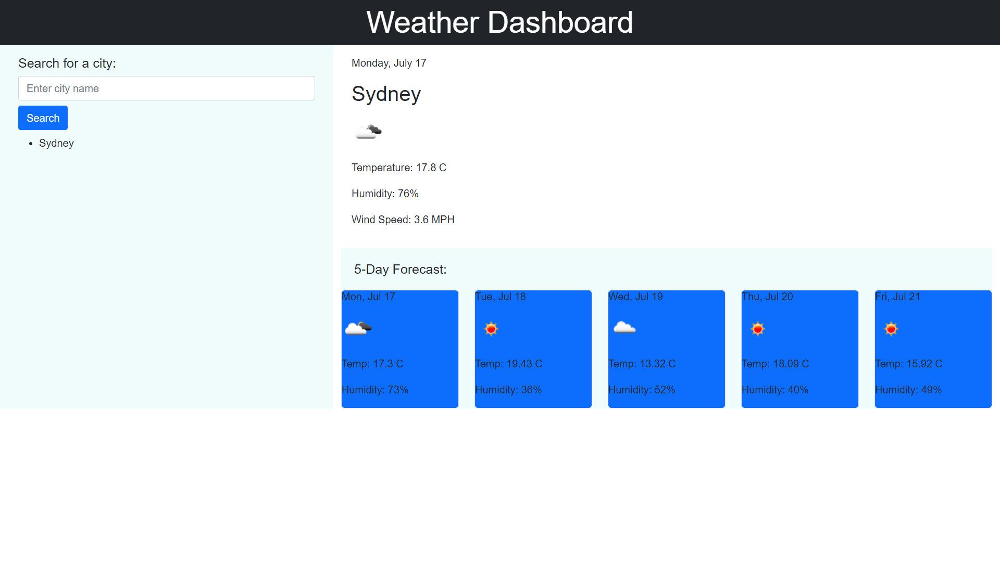

# Weather-Dashboard
An app to view the five day of cities from all over the world

## Usage
Users can input a city of their choice from all over the world in the aside seach bar, their most recent search will be recorded. A large display of the current weather, along with the current date will appear in the main section. Underneath that a display of weather of the tnext five days will appear below in smaller boxes

## Deployed Link
https://anuf0.github.io/Weather-Dashboard/\

## Screenshot

